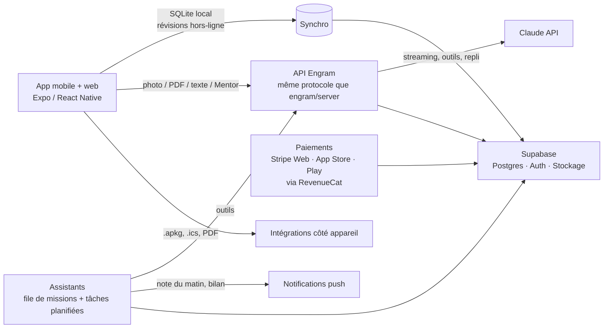

# Engram — fiche technique, idées et plan de construction (v3)

> **Engram** : l'app de flashcards qui fait le travail à votre place, dans votre langue.
> Vous photographiez votre cours (ou déposez un PDF, un paquet Anki), l'IA rédige les cartes, **Mentor** construit votre programme jusqu'au jour de l'examen et agit dans l'app à votre demande, **six assistants** relisent et complètent vos paquets et préparent vos séances, FSRS décide quand revoir chaque carte, et l'IA corrige vos réponses même quand elles ne sont pas mot pour mot, **tapées, dictées ou écrites à la main au stylet**.

Ce document accompagne le prototype livré dans ce dossier (`engram/index.html` et le serveur `engram/server/`).

1. [Ce qui change en v3](#1-ce-qui-change-en-v3)
   - [Stylet, iPad et mise en ligne](#1-bis-stylet-ipad-et-mise-en-ligne)
   - [Engram Pro et les six assistants](#1-ter-engram-pro-et-les-six-assistants)
2. [Anki : ce qu'il fait bien, ce qu'il fait mal](#2-anki--ce-quil-fait-bien-ce-quil-fait-mal)
3. [Ce que le prototype fait](#3-ce-que-le-prototype-fait)
4. [Cinq langues, entièrement traduites](#4-cinq-langues-entièrement-traduites)
5. [Mentor : l'assistant qui agit](#5-mentor--lassistant-qui-agit)
6. [Le programme ultra-personnalisé](#6-le-programme-ultra-personnalisé)
7. [Intégrations](#7-intégrations)
8. [Personnalisation](#8-personnalisation)
9. [Le serveur Engram (l'IA hors de l'app Claude)](#9-le-serveur-engram-lia-hors-de-lapp-claude)
10. [Architecture de la vraie app](#10-architecture-de-la-vraie-app)
11. [Coûts de l'IA, chiffrés](#11-coûts-de-lia-chiffrés)
12. [Budget : quatre niveaux d'investissement](#12-budget--quatre-niveaux-dinvestissement)
13. [Modèle économique](#13-modèle-économique)
14. [Planning](#14-planning)
15. [Indicateurs, risques et parades](#15-indicateurs-risques-et-parades)
16. [Design : le système visuel](#16-design--le-système-visuel)
17. [Tests réalisés](#17-tests-réalisés)

---

## 1. Ce qui change en v3

| | v2 | v3 |
|---|---|---|
| Langues | français | **français, anglais, espagnol, allemand, portugais** : interface, exemples, consignes de l'IA, dates, nombres, pluriels, notes d'examen au barème de chaque pays |
| Assistant | prof virtuel par paquet | **Mentor** : un assistant qui *agit* (18 actions : créer des paquets et des fiches, reformuler, planifier un examen, régler l'app…), avec reçus, confirmation et bouton Annuler ; trois niveaux dont **Expert** (Claude Fable 5.1 avec le serveur Engram) |
| Programme | un examen, nouvelles fiches par jour | **programme calculé chaque jour** : plusieurs examens, temps disponible pour chaque jour de la semaine, charge future simulée sur 28 jours, préparation prévue le jour J, conseils, lettre hebdomadaire de Mentor, export vers l'agenda |
| Intégrations | CSV, TSV, JSON | **Anki `.apkg` en import et en export** (avec images et progression), Quizlet / Excel / Google Sheets / Notion par copier-coller, **PDF de cours**, **fiches à imprimer** en PDF recto-verso, **agenda** (.ics, Google Agenda, Outlook), glisser-déposer |
| Apparence | clair / sombre | **7 thèmes**, 6 accents, 3 typographies, taille du texte, densité, 4 papiers de fiche, mouvement réglable |
| IA hors de l'app Claude | à brancher soi-même | **serveur Engram** prêt à déployer (Node, SDK officiel Anthropic, Docker) **et fonction Netlify** (même code) |
| Stylet | — | **réponses écrites à la main et corrigées par l'IA**, brouillon, schémas dessinés sur les fiches, notes manuscrites → fiches |
| Appareils | ordinateur et mobile | **app installable** (iPad, iPhone, Android, ordinateur), hors-ligne, mise en page iPad en paysage |
| Abonnement et agents | — | **Engram Pro** (3 formules, essai de 14 jours, quotas) et **six assistants IA** qui relisent, complètent, préparent les séances et les examens blancs, font le bilan de la semaine ; **autopilote** chaque matin ; tout est proposé, rien n'est modifié sans accord |

## 1 bis. Stylet, iPad et mise en ligne

**Répondre à la main.** En séance, le bouton plume (à côté de « Retourner » et « Écrire ») ouvre une feuille lignée sous la fiche ; sur iPad en paysage, la fiche est à gauche et la feuille à droite. On écrit au stylet (Apple Pencil, S Pen, stylet Surface), au doigt ou à la souris, puis **Faire corriger** : l'IA lit l'écriture (formules, flèches, abréviations, mots barrés ignorés), affiche ce qu'elle a lu, compare à la réponse attendue selon la sévérité choisie (souple, standard, strict) et suggère la note. Écriture illisible : l'IA le dit, sans pénaliser à tort. Sans IA, l'écriture s'affiche au verso à côté de la bonne réponse et l'on se note soi-même.

**Un vrai trait de plume.** Épaisseur réglée par la pression du stylet (par la vitesse au doigt et à la souris), courbes lissées, points intermédiaires du stylet (jusqu'à 240 par seconde) tous pris en compte ; **la paume peut se poser** (dès qu'un stylet a touché l'écran, le doigt ne trace plus) ; **gomme** au bout du stylet ou par l'outil ; annuler, rétablir, tout effacer ; **pointe visible au survol** sur les iPad Pro récents. Les traits sont gardés en coordonnées relatives : ils suivent la rotation de l'iPad.

**Brouillon.** Une feuille transparente posée sur la table et la fiche : on calcule, on souligne au surligneur, on schématise ; elle s'efface à la fiche suivante.

**Schémas sur les fiches.** Dans l'éditeur, « Ajouter un schéma dessiné » au recto ou au verso ; le dessin est enregistré avec la fiche, synchronisé, exporté en `.apkg` (image PNG) et dans les sauvegardes.

**Notes manuscrites → fiches.** Dans le scanner, « Écrire mes notes à la main » ouvre une grande feuille lignée ; la page part au scanner comme une photo, et l'IA en tire les fiches.

**Tablette et téléphone.** Cibles plus larges sur tablette, aucun survol « collé » après un toucher, pas de zoom au double toucher sur les boutons, fiche plus grande sur iPad. **App installable** : Safari → Partager → « Sur l'écran d'accueil » (iPad, iPhone), ou « Installer » (Chrome, Edge) ; plein écran, icône Engram, raccourcis « Réviser » et « Scanner un cours » ; **hors-ligne** une fois ouverte (seule l'IA a besoin du réseau).

**Mise en ligne.** Voir [le serveur Engram](#9-le-serveur-engram-lia-hors-de-lapp-claude) : un site Netlify dédié à Engram, avec l'IA, en quatre réglages.

**Idées pour la suite** : lecture de l'écriture sans réseau, sur l'appareil (modèle embarqué) ; dessiner les masques d'une image au stylet directement dans la séance ; dictée et écriture mêlées pour les langues ; examen blanc entièrement manuscrit, corrigé copie par copie.

## 1 ter. Engram Pro et les six assistants

**L'idée.** Mentor répond quand on lui parle. Les **assistants** travaillent sans qu'on le demande, chacun avec un seul métier. Ils ont tous la même règle : ils lisent vos fiches et votre historique, **proposent**, et c'est vous qui décidez. Chaque proposition s'applique ou s'ignore une par une, et un bouton annule tout ce qui a été appliqué.

| Assistant | Métier | Ce qu'il fait | Sans IA |
|---|---|---|---|
| **Le Planificateur** | Le mot du matin | Lit la journée (fiches dues, examens, temps libre, fiches qui s'effacent), prépare la séance idéale et l'explique en trois lignes. Bouton « Lancer la séance préparée ». | oui |
| **Le Correcteur** | Docteur des fiches | Relit un paquet comme un professeur : doublons, réponses trop longues, questions mal formées ; avec l'IA, aussi le fond (ambiguïtés, erreurs, fiches à scinder). Propose des réécritures avant / après et des suppressions. | oui |
| **Le Répétiteur** | Anti-oubli | Prend les fiches souvent oubliées, invente un moyen mnémotechnique, une image ou un exemple pour chacune, puis prépare une séance ciblée. | IA |
| **Le Documentaliste** | Paquets complets | Repère ce qui manque à un paquet pour couvrir le sujet et rédige les fiches absentes (question/réponse, texte à trous, QCM, vrai/faux). | IA |
| **L'Examinateur** | Examens blancs sur mesure | Compose un examen blanc chronométré sur les points faibles et sur le programme du prochain examen ; avec l'IA, ajoute les questions qui manquent. | oui |
| **Le Chroniqueur** | Bilan de la semaine | Chaque lundi : révisions, réussite et temps comparés à la semaine d'avant, paquets qui progressent ou glissent, état de préparation à l'examen, trois priorités. | oui |

**La fenêtre de mission.** À gauche, le **journal de bord** : chaque lecture et chaque outil appelé par l'IA s'y inscrit en direct (« Lecture des fiches · Biologie, 60 fiches lues », « Rédaction d'une proposition »). À droite, la **note** de l'assistant, écrite à la plume, puis les **propositions** (avant / après, fiches à retirer, fiches nouvelles). En bas : Tout appliquer, Annuler les changements, et l'action préparée (séance, examen blanc). Chaque proposition appliquée reçoit un tampon « Appliqué ».

**L'autopilote (Pro).** Chaque matin, à l'ouverture de l'app, le Planificateur prépare la séance du jour et sa note apparaît sur l'accueil ; chaque lundi, le Chroniqueur écrit le bilan. L'autopilote ne modifie jamais rien : il prépare. Dans la vraie app, il tournera côté serveur à l'heure choisie, avec une notification (§10).

**Comment c'est construit.** Chaque assistant a deux moteurs :
- un **moteur local**, sans IA et gratuit (`AgentLocal`), pour le Planificateur, le Correcteur, l'Examinateur et le Chroniqueur : c'est lui qui tourne sans connexion, quand le quota IA est épuisé, ou quand l'IA ne répond pas ;
- un **moteur IA** (`AgentAI`) : Claude reçoit une mission écrite et un petit jeu d'**outils** limité à ce métier (`get_deck_cards`, `get_week`, `get_stats`, `get_plan`, `propose_edit`, `propose_delete`, `propose_new_cards`, `prepare_session`, `prepare_exam`). Les outils de proposition n'écrivent rien : ils affichent une proposition. Seul le clic de la personne modifie les fiches, et l'état complet est photographié avant la mission pour tout annuler.
- Si le compte ne permet pas les outils, un repli demande une seule réponse JSON (note + propositions).
- Mentor peut confier une mission à un assistant (« relis mon paquet de SVT » → le Correcteur s'ouvre sur ce paquet).
- Historique : les 30 dernières missions (`S.profile.agents.runs`), la note du matin et le bilan de la semaine sont gardés et synchronisés.

**Engram Pro : trois formules**

| | Découverte | **Pro** | Pro Expert |
|---|---|---|---|
| Prix | 0 € | **7,99 € / mois** ou 79,90 € / an | 14,99 € / mois ou 149,90 € / an |
| Scans de cours par l'IA | 3 par mois | sans limite* | sans limite* |
| Correction IA des réponses | 30 par jour | sans limite* | sans limite* |
| Mentor | 20 messages par mois | sans limite* | sans limite*, mode **Expert** |
| Les six assistants | 3 missions IA par mois, analyses locales illimitées | sans limite* | sans limite*, 150 fiches lues par mission |
| Autopilote (note du matin, bilan du lundi) | — | oui | oui |
| Modèle d'IA | standard | standard | **le plus puissant** (Claude Fable 5.1) |

\* « Usage raisonnable » : voir §13.

**Essai de 14 jours** de Pro Expert, proposé une fois par compte. Le passage à Découverte ne supprime rien (paquets, historique, notes). Quand un quota est atteint, l'app le dit avec une fenêtre claire et la version locale prend le relais quand elle existe.

**La page Pro** : carte de lecteur en cuir et dorure qui s'incline sous le doigt, reflet qui la traverse, cachet qui s'y imprime ; bascule mensuel / annuel avec le prix qui se retourne ; les trois formules, un tableau de comparaison, des jauges de consommation du mois, les questions fréquentes. À l'activation : un accueil avec des paillettes d'or, puis la salle des assistants. Toutes les animations respectent le réglage « mouvement réduit ».

> **Prototype** : les paiements ne sont pas branchés. Choisir une formule l'active tout de suite sur l'appareil. À la mise en ligne : **Stripe** sur le Web, **achats intégrés App Store et Google Play** dans les applications, réunis par **RevenueCat** (§10). Dans l'app Claude, l'IA est payée par le compte Claude de la personne : les quotas y servent de démonstration.

**Idées pour la suite** : un assistant **Tuteur de langue** (conversation orale sur le vocabulaire du paquet) ; un **Veilleur** qui surveille les dates d'examen de la classe ; des **missions de groupe** (le Correcteur relit le paquet partagé d'une classe, le professeur valide) ; un assistant qui lit **Google Classroom ou Moodle** et prépare les fiches du prochain cours ; des missions planifiées par la personne (« chaque dimanche soir, relis les fiches de la semaine »).

---

## 2. Anki : ce qu'il fait bien, ce qu'il fait mal

| | Anki |
|---|---|
| **Principe** | Répétition espacée + rappel actif : on revoit une notion juste avant de l'oublier. |
| **Algorithme** | SM-2 modifié historiquement ; **FSRS** intégré depuis Anki 23.10. |
| **Types de cartes** | Recto/verso, texte à trous, masquage d'image, modèles HTML/CSS/JS. |
| **Plateformes** | Windows / macOS / Linux, AnkiDroid, AnkiMobile (payant), AnkiWeb. |
| **Écosystème** | Des milliers d'extensions et de paquets partagés. |

**Ses faiblesses sont nos opportunités** : création manuelle carte par carte ; interface datée et réglages intimidants ; correction caractère par caractère (un synonyme = faux) ; aucune explication quand on bloque ; aucun plan pour arriver prêt à un examen ; pas de motivation.

**Notre position** : on ne remplace pas Anki de force, on l'accueille. Engram **importe les paquets Anki** (y compris la progression et les images) et **les réexporte**, pour que personne ne perde des années de révisions en essayant.

---

## 3. Ce que le prototype fait

`engram/index.html` est une application complète, en un seul fichier, qui s'ouvre dans n'importe quel navigateur. Publiée comme artefact dans l'app Claude, elle utilise l'IA et la synchronisation du compte Claude de la personne ; ailleurs, elle se branche sur le serveur Engram.

| Domaine | Fonctionnalités | Où dans le code |
|---|---|---|
| **Capturer** | Photo de cours (1 à 5 pages, manuscrit ou imprimé), **PDF** (texte extrait dans le navigateur ; pages scannées lues par l'IA), texte collé, simple sujet ; langue des fiches au choix ; fiches qui tombent en direct pendant la génération ; génération locale sans IA | `runScan`, `buildGenPrompt`, `loadPdfForScan`, `localGenerate` |
| **Types de cartes** | Question/réponse (avec images), recto-verso 2 sens, texte à trous, QCM, vrai/faux, remise en ordre, masquage d'image | `cardFaces`, `openEditor`, `openOcclusion` |
| **Retenir** | FSRS-5, rétention cible 80–97 %, boîte de Leitner visuelle, file à la Anki, sangsues, atelier des points faibles | `FSRS`, `Study.build` |
| **Être corrigé** | Réponse écrite ou dictée corrigée par l'IA (score, verdict, mots-clés manquants, stylo rouge), exigence Souple / Standard / Strict, correction locale de secours dans les 5 langues | `aiGrade`, `localGrade`, `STRICT` |
| **Comprendre** | Mentor (§5), prof virtuel après un échec, discussion par paquet, fiches de synthèse enregistrées comme notes, amélioration IA d'une carte et moyen mnémotechnique | `Mentor`, `Study.tutor`, `openSheet` |
| **Planifier** | Programme quotidien (§6), plusieurs examens, préparation prévue au jour J, lettre de la semaine, export agenda | `Plan`, `Views.plan` |
| **Jouer, s'évaluer** | Jeu des paires chronométré, examen blanc noté **au barème du pays** (sur 20 en France, 1,0–5,0 en Allemagne, sur 10 en Espagne et au Brésil, pourcentage et lettre en anglais), mode écoute | `Game`, `gradeScale` |
| **Motiver** | Série sur fiche de prêt, niveaux, 18 cachets de cire, bordereau de fin de séance, image de progression à partager | `BADGES`, `Study.summary`, `shareProgress` |
| **Importer, exporter** | §7 | `70-integrations` |
| **Personnaliser** | §8 | `Custom` |
| **Tout le reste** | Accueil guidé en 5 étapes (langue, profil, rythme, examen, apparence), palette de commandes (Ctrl/⌘ K), raccourcis clavier complets, synchronisation multi-appareils dans l'app Claude, mobile, accessibilité (mouvement réduit, focus visible, contrastes WCAG AA) | `Onb`, `openPalette`, `Store` |

---

## 4. Cinq langues, entièrement traduites

**Français, English, Español, Deutsch, Português.** La langue est détectée depuis le navigateur au premier lancement, choisie à l'accueil, changeable à tout moment (bouton de langue en haut, Réglages, ou en demandant à Mentor).

**Ce qui est traduit** : les quelque 1 350 phrases de l'interface ; les paquets d'exemple (cinq jeux de contenus distincts, pas une traduction mot à mot : l'élève francophone apprend l'anglais, l'élève anglophone apprend l'espagnol) ; le cours d'exemple du scanner ; les consignes données à l'IA (écrites en anglais pour la fiabilité, avec l'ordre explicite de répondre dans la langue de la personne) ; les verbes de définition reconnus par la génération locale ; les mots vides et la racinisation de la correction locale ; les voix de lecture ; les notes d'examen blanc.

**Comment c'est construit**

- Le texte source est en français, directement dans le code : `t('Aujourd\'hui')`. Un dictionnaire unique `TR` associe chaque phrase à ses quatre traductions.
- Pluriels : `tp(n, 'fiche|fiches')`, choisis avec `Intl.PluralRules` (règles réelles de chaque langue).
- Dates, jours, mois, nombres, pourcentages, noms de langues : `Intl.DateTimeFormat`, `NumberFormat`, `DisplayNames` (fr-FR, en-GB, es-ES, de-DE, pt-BR).
- Typographie : espace insécable avant les deux-points en français seulement ; guillemets «…» en français et en espagnol, „…“ en allemand, “…” en anglais et en portugais du Brésil.
- Contrôle automatique : un script extrait toutes les phrases du code (analyse syntaxique), vérifie que chaque traduction garde les mêmes `{variables}` et le même nombre de formes de pluriel ; un test parcourt l'app entière dans chaque langue et échoue s'il reste une phrase non traduite ou un mot français visible.
- **Ajouter une langue** : une colonne au dictionnaire, une entrée dans `UI_LANGS`, un jeu d'exemples dans `DEMO`. Rien d'autre à toucher.

> Les traductions ont été rédigées avec l'IA et vérifiées automatiquement (variables, pluriels, longueur à l'écran). Avant un lancement commercial, faites-les relire par un locuteur natif par langue (budget au §12).

---

## 5. Mentor : l'assistant qui agit

Mentor est un tiroir latéral (bouton en bas à droite, **Ctrl/⌘ J** ou **/**) qui connaît l'état complet de l'app : paquets, fiches fragiles, examens, programme, statistiques, profil, et ce qu'il a retenu de la personne. Il ne se contente pas de répondre : il **fait**.

| Action | Ce que Mentor peut faire |
|---|---|
| Lire | `get_deck_cards`, `get_stats`, `get_plan` : cartes d'un paquet, rétention sur 30 jours, sujets faibles, charge des 14 prochains jours, préparation aux examens |
| Créer | `create_deck`, `add_cards` (6 types de cartes, jusqu'à 30 par appel), `save_note` (fiche de synthèse enregistrée dans le paquet) |
| Modifier | `update_deck`, `update_card` (reformuler une sangsue), `delete_cards` (**toujours confirmé à l'écran**) |
| Planifier | `set_exam`, `remove_exam`, `update_study_profile` (objectif, niveau, minutes pour chaque jour, moment préféré) |
| Régler | `change_settings` : langue, thème, accent, police, taille du texte, papier, animations, exigence de correction, ton de Mentor… |
| Se souvenir | `remember`, `forget` : faits durables (« confond mitose et méiose », « bac le 17 juin », « préfère les QCM ») réutilisés par toutes les fonctions IA |
| Proposer | `start_session` (bouton pour lancer une séance ciblée), `open_view`, `export_calendar` |

**Garde-fous** : chaque action laisse un **reçu** sous la réponse ; toute modification peut être **annulée d'un clic** (instantané de l'état avant la réponse) ; les suppressions demandent une confirmation ; l'historique de conversation reste sur l'appareil.

**Personnalité** : trois tons au choix (Bienveillant, Coach, Exigeant). **Niveau d'intelligence** : Rapide, Standard, Expert. Dans l'app Claude, ces niveaux sont transmis tels quels ; avec le serveur Engram, ils correspondent à des modèles (§9).

**Idées de demandes** : « Prépare-moi pour mon bac de SVT du 17 juin », « Crée 15 fiches sur la Révolution française », « Reformule mes cartes les plus oubliées », « Je n'ai que 10 minutes le mardi », « Fais le débrief de ma séance », « Passe l'app en espagnol et en thème Minuit ».

**Architecture** : Mentor est une boucle d'outils classique. La page décrit ses 18 fonctions (nom, description, schéma JSON) ; le modèle choisit lesquelles appeler ; la page les exécute et renvoie les résultats ; jusqu'à 7 tours par message. Dans l'app Claude, la capacité `sample` gère la boucle ; avec le serveur, c'est la page (`ServerAI.ask`) qui la mène, le serveur ne faisant qu'un tour à la fois — il ne voit jamais les données en dehors de ce que la conversation contient.

---

## 6. Le programme ultra-personnalisé

L'onglet **Programme** répond chaque jour à une question : *qu'est-ce que je révise aujourd'hui pour être prêt à temps, sans y passer plus de temps que j'en ai ?*

**Entrées** : les examens (date, paquets concernés), le temps disponible **pour chaque jour de la semaine**, le moment préféré (matin, midi, soir, nuit), le temps moyen mesuré par carte (nouvelles ≈ 2,6 × une révision), l'état FSRS de chaque carte.

**Calcul** (simulation sur 28 jours, `Plan.compute`) :

1. On place chaque révision déjà prévue par FSRS sur son jour.
2. Pour les paquets qui ont un examen, on répartit les cartes jamais vues **jusqu'à deux jours avant le jour J** (marge de consolidation), le plus proche d'abord.
3. Les autres paquets se partagent le temps restant, dans la limite du réglage « nouvelles par jour ».
4. Chaque nouvelle carte introduite génère des révisions futures (retours moyens à J+1, J+3, J+9, J+25) ajoutées à la charge des jours suivants.
5. Les jours où la charge dépasse le temps disponible sont signalés, avec un conseil.

**Sorties** : la liste du jour (reprises, révisions par paquet, nouvelles par paquet), un calendrier de 14 jours (minutes prévues contre minutes disponibles), pour chaque examen la **mémoire prévue le jour J** en suivant le programme et sans réviser, des conseils calculés (et, avec l'IA, une **lettre de la semaine** écrite par Mentor), l'**export vers l'agenda** (un créneau par jour à l'heure choisie + les examens).

La séance du jour respecte ces quotas : ouvrir « Réviser » suffit, le programme est déjà dedans.

---

## 7. Intégrations

Tout passe par une seule page, **Intégrations**, en quatre onglets : Importer, Exporter, Agenda, Sauvegarde. Elle s'ouvre depuis les Réglages, le Fichier, la page d'un paquet (Exporter), la palette de commandes et Mentor. Chaque passerelle indique comment elle fonctionne (par fichier, par copier-coller, par lien, avec l'IA) et donne les étapes.

| Intégration | Sens | Détails |
|---|---|---|
| **Anki** `.apkg` / `.colpkg` | import | Anciens formats (`collection.anki2`, `.anki21`) et nouveau format compressé (`collection.anki21b`, zstd). Sous-paquets, étiquettes, textes à trous (une carte par trou), cartes inversées, **images**, cartes suspendues, **progression** (échéance, stabilité et difficulté FSRS quand elles existent). HTML nettoyé, sons retirés. |
| **Anki** `.apkg` | export | Paquet lisible par Anki, AnkiDroid et AnkiMobile, avec modèles « Engram — Basic » et « Engram — Cloze », images, étiquettes et progression. Vérifié en le rouvrant avec la bibliothèque officielle d'Anki. |
| Texte exporté d'Anki | import | En-têtes `#separator:`, `#html:`, guillemets. |
| **Quizlet, Excel, Google Sheets, Notion** | import | Copier-coller : séparateur deviné (tabulation, tiret, point-virgule, virgule, deux-points), **tableaux Markdown** (Notion, ChatGPT), puces et numéros retirés, aperçu, inversion, création des deux sens, dans un paquet existant ou nouveau. |
| **Quizlet** | export | Copié au format d'import de Quizlet (terme, tabulation, définition), prêt à coller dans Créer, puis Importer. |
| **Excel, Numbers, Google Sheets** | export | Tableau copié (colonnes recto, verso, note, paquet) à coller dans une feuille, ou fichier CSV. |
| **Notion** | export | Tableau Markdown copié, qui devient un tableau en le collant dans une page. |
| CSV / TSV / TXT | import, export | Détection du séparateur, guillemets CSV. |
| Sauvegarde Engram (JSON) | import, export | Paquets, notes, images, examens, profil. Restauration par fichier ou en collant le contenu ; les paquets s'ajoutent, rien n'est effacé. |
| **PDF de cours** | import | Texte extrait dans le navigateur (pdf.js, jusqu'à 80 pages), puis fiches par l'IA ou localement ; un PDF scanné est rendu en images pour l'IA. |
| **Fiches à imprimer** | export | PDF A4, 8 fiches par page, recto-verso aligné pour l'impression bord long, traits de coupe. |
| **Agenda** | export | Fichier `.ics` (créneaux quotidiens + examens, compatible Google, Apple, Outlook) et liens directs Google Agenda / Outlook pour chaque examen. |
| Glisser-déposer | import | N'importe quel fichier ci-dessus, n'importe où sur la page. |

Les bibliothèques (JSZip, sql.js, fzstd, pdf.js, jsPDF) ne sont chargées qu'au premier usage, depuis jsDelivr.

> Dans l'app Claude, seules certaines extensions de téléchargement sont permises : un `.apkg` y est enregistré en `.apkg.zip` et un `.ics` en `.ics.txt`, avec une notice pour les renommer ; un `.apkg.zip` se réimporte tel quel. Hors de l'app Claude, les fichiers ont leur nom normal.
>
> Enregistrement des fichiers : la fenêtre de confirmation de Claude dans l'app Claude, le téléchargement habituel dans un navigateur. Dans une fenêtre intégrée qui ne sait pas télécharger, Engram le dit, propose de copier le texte ou de partager le fichier, et n'affiche jamais « Fichier prêt » à tort. Les champs de fichier n'imposent pas d'extension, car l'iPhone grise sinon les `.apkg` ; le contenu est vérifié après le choix.

---

## 8. Personnalisation

Tout se règle dans **Réglages → Apparence** (ou en demandant à Mentor) :

- **Thèmes** : Automatique (suit l'appareil), Salle de lecture (vert bibliothèque et laiton), Bureau (ivoire et vert sapin), Minuit (bleu nuit et cuivre), Atelier (terre cuite et crème), Ébène (noir OLED et or), Contraste (noir sur blanc, lisibilité maximale).
- **Accents** : celui du thème, laiton, vermillon, cobalt, émeraude, prune.
- **Typographies** : Classique, Éditoriale (Fraunces + Instrument Sans), Très lisible (Atkinson Hyperlegible, conçue pour les personnes malvoyantes).
- **Taille du texte** (85 à 130 %), **densité** (aérée, compacte), **papier des fiches** (ligné, uni, quadrillé, ardoise), **animations** (complètes, rapides, aucune), décor du bureau.
- Tous les thèmes respectent un contraste WCAG AA (≥ 4,5:1) pour le texte, mesuré automatiquement.

---

## 9. Le serveur Engram (l'IA hors de l'app Claude)

Pour publier Engram sur votre propre site ou en faire une app, l'IA passe par `engram/server/` : un petit serveur Node (sans framework) qui **garde la clé d'API côté serveur**, sert l'application et relaie l'API Claude avec le SDK officiel `@anthropic-ai/sdk`. L'app le détecte seule (`/api/ai/health`).

```bash
cd engram/server
npm install
ANTHROPIC_API_KEY=sk-ant-... npm start      # → http://localhost:8787
```

ou avec Docker, depuis `engram/` : `docker build -f server/Dockerfile -t engram . && docker run -p 8787:8787 -e ANTHROPIC_API_KEY=... engram`.

| Variable | Défaut | Rôle |
|---|---|---|
| `ANTHROPIC_API_KEY` | — | Clé de l'API Claude (obligatoire) |
| `ENGRAM_MODEL_QUICK` / `_DEFAULT` / `_COMPLEX` | `claude-sonnet-5-5` / `claude-opus-5-5` / `claude-fable-5-1` | Modèle de chaque niveau (Rapide, Standard, Expert) |
| `ENGRAM_EFFORT_QUICK` / `_DEFAULT` / `_COMPLEX` | `low` / `medium` / `high` | Effort de réflexion par niveau |
| `ENGRAM_ACCESS_CODE` | — | Code demandé dans Réglages → IA (recommandé dès que le serveur est public) |
| `ENGRAM_RATE_PER_MIN` | 30 | Requêtes par minute et par adresse |
| `ENGRAM_FALLBACKS` | activé | Repli automatique si un modèle décline une requête (`off` pour désactiver) |
| `ENGRAM_CORS_ORIGIN` | — | Origines autorisées si l'app est servie ailleurs |
| `ENGRAM_MAX_TOKENS`, `ENGRAM_MAX_BODY_MB`, `PORT`, `ENGRAM_TRUST_PROXY` | 32000, 12, 8787, — | Limites et réseau |

**Ce qu'il fait** : flux de texte en direct (NDJSON), photos, outils de Mentor, mode JSON pour la génération et la correction ; **mise en cache automatique** du début de conversation (les tours successifs de Mentor coûtent moins cher) ; **repli automatique** : si le modèle demandé décline une requête (classifieurs de sécurité), l'API la relance sur le modèle recommandé dans le même appel (paramètre bêta `fallbacks: "default"`) ; si toute la chaîne décline, la réponse partielle est écartée et l'app affiche un message clair ; contrôle du code d'accès (comparaison à temps constant), limite de débit, taille maximale des requêtes, validation des messages.

Extrait du cœur du serveur :

```js
const stream = client.beta.messages.stream({
  model: tier.model,                       // ex. claude-fable-5-1 pour « Expert »
  max_tokens: 32000,
  output_config: { effort: tier.effort },
  system, messages, tools,
  cache_control: { type: "ephemeral" },    // cache automatique du préfixe
  betas: ["server-side-fallback-2026-07-01"],
  fallbacks: "default",                    // repli si le modèle décline
}, { signal });
stream.on("text", (delta) => write({ type: "text", delta }));
const msg = await stream.finalMessage();
if (msg.stop_reason === "refusal") write({ type: "error", code: "refused" });
else write({ type: "done", content: sanitize(msg.content, msg.stop_reason), stop_reason: msg.stop_reason });
```

Pour réduire encore les coûts, `ENGRAM_MODEL_DEFAULT=claude-sonnet-5-5` divise par deux le prix des scans, de Mentor et des assistants : à valider d'abord sur de vraies photos de cours.

Le relais lui-même est dans `server/core.mjs`, écrit avec les objets standard du Web (`Request`, `Response`, flux) : le même code tourne dans le serveur Node, dans l'image Docker et dans une fonction Netlify. Pendant que le modèle réfléchit, le relais envoie une ligne `{"type":"ping"}` toutes les 10 secondes pour que les hébergeurs ne coupent pas une connexion muette.

### Mettre Engram en ligne sur Netlify

Le site de STOCKR, à la racine du dépôt, n'est pas touché : Engram a son propre site Netlify.

1. Netlify → **Add new site → Import an existing project** → ce dépôt GitHub.
2. **Base directory** : `engram`. Le reste est lu dans `engram/netlify.toml` (commande de build, dossier publié `_site`, fonction `netlify/functions/ai.mjs`, Node 22, en-têtes).
3. **Site configuration → Environment variables** : `ANTHROPIC_API_KEY` (obligatoire) et `ENGRAM_ACCESS_CODE` (conseillé : un site public sans code dépense vos crédits). Les autres variables du tableau ci-dessus fonctionnent aussi.
4. **Deploy**. L'app trouve seule l'IA à `/api/ai` ; chaque pull request a son aperçu.

À savoir : Netlify limite la durée d'exécution d'une fonction selon l'offre. Les tâches courantes (correction, fiches, Mentor Rapide et Standard) passent ; pour les longues lectures (gros PDF scanné, Mentor Expert), si une requête est coupée, hébergez l'image Docker (Render, Railway, Fly.io, Scaleway) et indiquez son adresse dans **Réglages → IA et Mentor**.

---

## 10. Architecture de la vraie app



| Couche | Choix recommandé | Pourquoi |
|---|---|---|
| **App** | **Expo (React Native) + TypeScript** | iOS, Android et web avec un seul code ; la logique du prototype (FSRS, programme, correction locale, i18n, parseurs Anki) se porte telle quelle. |
| **Traductions** | le dictionnaire du prototype → format ICU / i18next | Même principe (phrase source, pluriels ICU), outils de traduction professionnels (Crowdin, Lokalise). |
| **Stockage local** | SQLite (expo-sqlite) | Réviser sans réseau ; import Anki directement dans SQLite. |
| **Backend** | Supabase (Postgres, Auth, Storage, Edge Functions), région UE | Comptes, base, fichiers, fonctions serveur sans administrer de machines. |
| **IA** | Claude API, **uniquement côté serveur** | Le serveur Engram est la base de l'API : quotas par offre, journal des coûts. |
| **Algorithme** | `ts-fsrs` + optimiseur `fsrs-rs` | Paramètres FSRS personnels après ~1 000 révisions : 10 à 30 % de révisions en moins. |
| **Paiements** | **Stripe** (Web) + **achats intégrés** App Store et Google Play, réunis par **RevenueCat** | Un seul état d'abonnement (`entitlements`) quel que soit l'endroit où l'on a payé ; essai de 14 jours, prix par pays, remboursements, relances de paiement échoué. |
| **Assistants** | File de missions (Postgres + worker), tâches planifiées par fuseau horaire, notifications push (Expo) | Le prototype lance l'autopilote à l'ouverture de l'app ; la vraie app prépare la note du matin **avant** le réveil, la pousse en notification, et passe les missions lourdes par la Batch API la nuit (−50 %). |
| **Quotas** | Compteurs par utilisateur et par mois côté serveur (`usage_counters`) | Les quotas du prototype sont gardés sur l'appareil : en production, seul le serveur fait foi. |
| **Analytique / erreurs** | PostHog + Sentry | |

**Tables principales** : `users` (langue, niveau, objectif, fuseau), `study_profiles` (minutes par jour, moment préféré, ton), `decks`, `notes`, `cards` (FSRS), `review_logs`, `exams`, `mentor_memory`, `mentor_actions` (journal des actions et annulations), `agent_runs` (assistant, paquet, note, propositions, appliquées), `agent_proposals`, `subscriptions` (formule, essai, source : Stripe, App Store, Play), `usage_counters`, `media`, `ai_jobs` (modèle, tokens, coût).

---

## 11. Coûts de l'IA, chiffrés

Tarifs publics de l'API Claude au 28 septembre 2026 (par million de tokens ; source : platform.claude.com/docs/en/about-claude/pricing) :

| Modèle | Entrée | Sortie | Lecture en cache | Rôle dans Engram |
|---|---|---|---|---|
| **Claude Fable 5.1** | 10 $ | 50 $ | 0,25 $ | Niveau **Expert** : Mentor et assistants de l'offre Pro Expert |
| **Claude Opus 5.5** | 4 $ | 20 $ | 0,20 $ | Niveau **Standard**, par défaut : photos et PDF → fiches, Mentor, missions des assistants, lettre de la semaine |
| **Claude Sonnet 5.5** | 2 $ | 10 $ | 0,20 $ | Niveau **Rapide** : corrections, notes du matin, amélioration d'une fiche, moyen mnémotechnique |
| Claude Haiku 4.5 | 1 $ | 5 $ | 0,10 $ | Le moins cher, mais plus ancien (connaissances arrêtées en février 2025) et retrait possible dès le 15 octobre 2026 : à éviter pour une app qui démarre |

Opus 5.5 remplace Opus 5 : plus récent et 20 % moins cher (Opus 5 coûtait 5 $ / 25 $). Batch API : −50 % pour les tâches qui peuvent attendre. Fable, Opus et Sonnet lisent les images et acceptent jusqu'à un million de tokens, sans supplément pour les longs documents.

| Tâche | Tokens (entrée / sortie, réflexion comprise) | Coût |
|---|---|---|
| Scan d'une page → 15 fiches (Opus 5.5) | ≈ 2 300 / 2 500 | **≈ 0,06 $** |
| PDF de 20 pages de texte → 40 fiches (Opus 5.5) | ≈ 12 000 / 6 000 | ≈ 0,17 $ |
| Correction d'une réponse (Sonnet 5.5, effort bas) | ≈ 400 / 150 | ≈ 0,002 $ |
| Correction d'une réponse **manuscrite** (image recadrée sur l'écriture, Sonnet 5.5) | ≈ 1 200 / 200 | ≈ 0,004 $ |
| Page de notes manuscrites → fiches (Opus 5.5) | ≈ 2 300 / 2 500 | ≈ 0,06 $ (comme une photo) |
| Message à Mentor, 2 à 3 actions (Opus 5.5, cache) | ≈ 12 000 (dont 70 % en cache) / 1 200 | ≈ 0,04 $ ; question simple sur Sonnet 5.5 : ≈ 0,02 $ |
| Message à Mentor en **Expert** (Fable 5.1, cache) | ≈ 12 000 / 2 000 | ≈ 0,14 $ |
| Lettre hebdomadaire de Mentor (Opus 5.5) | ≈ 3 000 / 800 | ≈ 0,03 $ |
| Mission du **Correcteur**, 60 fiches, 3 tours d'outils (Opus 5.5, cache) | ≈ 25 000 (la moitié en cache) / 2 500 | ≈ 0,10 $ |
| Mission du **Documentaliste**, 10 fiches rédigées (Opus 5.5) | ≈ 20 000 / 3 500 | ≈ 0,11 $ |
| Mission du **Planificateur** ou de l'**Examinateur** (Opus 5.5) | ≈ 15 000 / 1 200 | ≈ 0,06 $ |
| Mission en **Expert**, 150 fiches lues (Fable 5.1, cache) | ≈ 46 000 (la moitié en cache) / 3 000 | ≈ 0,39 $ |
| Note du matin de l'autopilote (Sonnet 5.5, sans outils) | ≈ 1 500 / 200 | ≈ 0,005 $ |
| Bilan du lundi, analyses locales des assistants | calcul sur l'appareil | 0 $ |

La cascade de correction (locale d'abord, IA seulement si ambigu) évite environ la moitié des appels.

**Coût IA par utilisateur et par mois** (en dollars ; 1 $ ≈ 0,92 €)

| Profil | Usage | Opus 5.5 partout | Réglage par défaut du serveur | **Configuration recommandée** |
|---|---|---|---|---|
| Découverte | 3 scans, 60 corrections, 20 messages Mentor, 3 missions | ≈ 1,40 $ | ≈ 1,30 $ | **≈ 0,70 $** (tout sur Sonnet 5.5) |
| Pro, usage normal | 30 scans, 600 corrections, 60 messages Mentor, 4 lettres, 12 missions, 30 notes du matin | ≈ 7,05 $ | ≈ 6,20 $ | **≈ 5,45 $** |
| Pro, usage intensif | 120 scans, 2 000 corrections, 200 messages, 40 missions | ≈ 23,70 $ | ≈ 21,30 $ | ≈ 18,70 $ → « usage raisonnable » |
| Pro Expert, usage normal | comme Pro normal, dont 30 messages et 8 missions en Expert | ≈ 12,35 $ | ≈ 11,50 $ | **≈ 11,15 $** |

**Réglage par défaut du serveur** (`server/core.mjs`) : Sonnet 5.5 pour le niveau rapide, Opus 5.5 pour le niveau standard, Fable 5.1 pour Expert. **Configuration recommandée** : ce réglage, plus Mentor qui répond avec Sonnet 5.5 aux questions simples (environ 2 messages sur 3) et passe à Opus 5.5 dès qu'il doit agir avec des outils ; Découverte entièrement sur Sonnet 5.5. À usage égal, c'est environ 20 % de moins qu'avec Opus 5, le modèle des versions précédentes de cette fiche.

C'est plus cher qu'en v2 parce que Mentor et les assistants lisent l'état de l'app : c'est ce qui les rend utiles. Autres leviers : cache (déjà actif ; sur Opus 5.5, une lecture en cache coûte 5 % du prix d'entrée), résumé de conversation après 16 échanges, Batch API (−50 %) pour l'autopilote et les imports lourds de nuit, et, si le jeu d'évaluation montre la même qualité, la lecture des photos sur Sonnet 5.5 : Pro normal passe alors à ≈ 4,55 $.

---

## 12. Budget : quatre niveaux d'investissement

| | A. Fondateur + IA | B. Freelance senior | C. Agence | **D. Studio produit (investissement fort)** |
|---|---|---|---|---|
| Équipe | Vous + Claude Code | 1 dev React Native | Chef de projet, 2 devs, designer | Équipe interne de 7 à 9 personnes pendant 12 mois (détail ci-dessous) |
| Développement | 0 € | 30 000 – 55 000 € | 70 000 – 140 000 € | 470 000 – 790 000 € |
| Design | 0 – 1 500 € | 3 000 – 6 000 € | inclus | inclus + motion designer |
| Traductions relues (5 langues) | 800 – 2 000 € | 800 – 2 000 € | 1 500 – 3 000 € | 15 000 – 30 000 € (agence + contenus d'exemple natifs + fiches des stores) |
| Contenu (paquets vérifiés par des enseignants) | — | — | — | 30 000 – 80 000 € |
| Durée jusqu'au lancement | 4 – 5 mois | 3 – 4 mois | 3 mois | 6 mois (v1 mondiale), puis itérations |
| **Total** | **≈ 2 000 – 6 000 €** | **≈ 35 000 – 65 000 €** | **≈ 75 000 – 145 000 €** | **≈ 800 000 € – 1,5 M€ sur 12 mois** |

**Scénario D détaillé** (Europe de l'Ouest, coûts chargés, 12 mois)

| Poste | Coût annuel |
|---|---|
| 2 développeurs mobiles seniors (React Native) | 180 000 – 260 000 € |
| 1 développeur backend / données (Supabase, synchro, import Anki) | 90 000 – 130 000 € |
| 1 ingénieur IA (consignes, évaluations, coûts, Mentor) | 100 000 – 150 000 € |
| 1 designer produit + motion à mi-temps | 70 000 – 110 000 € |
| 1 responsable produit / fondateur | 0 – 90 000 € |
| QA et accessibilité (freelance) | 30 000 – 50 000 € |
| Enseignants et relecteurs (contenus, 5 pays) | 30 000 – 80 000 € |
| Traduction professionnelle et localisation continue | 15 000 – 30 000 € |
| Juridique : CGU dans 5 pays, RGPD, mineurs, DPA, marque (UE + US + BR) | 15 000 – 35 000 € |
| Infrastructure (Supabase, Expo EAS, Sentry, PostHog) | 6 000 – 15 000 € |
| Crédits IA (bêta, évaluations, utilisateurs gratuits la première année) | 20 000 – 60 000 € |
| Acquisition : créateurs de contenu étudiants par pays, ambassadeurs, salons | 150 000 – 400 000 € |
| Réserve (10 %) | 70 000 – 130 000 € |

**Où mettre l'argent d'abord, si vous investissez beaucoup** :
1. **La qualité de l'IA** avant tout : un jeu d'évaluation de 500 vraies photos de cours dans les 5 langues, et un ingénieur IA qui mesure chaque changement de consigne (taux de cartes gardées, justesse des corrections, coût par page).
2. **L'import Anki et l'export** parfaits : c'est la porte d'entrée des étudiants en médecine et en langues, les plus gros utilisateurs de flashcards.
3. **Des traductions et des exemples natifs**, relus par des enseignants de chaque pays, plus des examens blancs au format local (bac, Abitur, ENEM, selectividad, A-levels).
4. **L'acquisition locale** (créateurs étudiants par pays) seulement une fois la rétention J30 au-dessus de 25 %.

**Frais fixes, quel que soit le scénario** : Apple Developer 99 $/an ; Google Play 25 $ une fois ; domaine ~15 €/an ; Supabase Pro 25 $/mois ; Expo EAS gratuit (15 compilations iOS et 15 Android par mois), 19 $/mois en Starter ; RevenueCat gratuit jusqu'à 2 500 $ de revenus mensuels ; hébergement du serveur Engram (Render, Fly, Railway, Scaleway) 5 – 25 €/mois, ou Netlify (gratuit avec 300 crédits par mois, puis 9 $/mois en Personal ou 20 $/mois en Pro, relevé en septembre 2026) ; marque INPI 190 € pour une classe, 40 € par classe en plus (EUIPO ~850 € pour l'UE). Commission des stores sur les abonnements : 15 % sous 1 million de dollars de chiffre d'affaires annuel.

---

## 13. Modèle économique

| Offre | Prix (zone euro, TTC) | Contenu |
|---|---|---|
| Découverte | 0 € | 3 scans par mois, 30 corrections IA par jour, 20 messages Mentor, 3 missions d'assistants avec l'IA (analyses locales illimitées), cartes illimitées, FSRS, programme, import/export Anki |
| **Pro** | **7,99 € / mois** ou **79,90 € / an** (2 mois offerts) | Scans, corrections, Mentor et six assistants sans limite (usage raisonnable), autopilote, lettre de la semaine, synchro |
| **Pro Expert** | 14,99 € / mois ou 149,90 € / an | Tout Pro + le modèle le plus puissant (Claude Fable 5.1) pour Mentor et les assistants, 150 fiches lues par mission |
| Essai | 14 jours de Pro Expert, une fois par compte | Sur les stores, l'essai gratuit s'attache à l'abonnement (moyen de paiement demandé, annulable) |

Prix adaptés par pays (parité de pouvoir d'achat) : environ 4,99 $ au Brésil, 6,99 £ au Royaume-Uni, 7,99 $ aux États-Unis ; tarif étudiant possible à −30 % avec vérification (UNiDAYS, SheerID).

**Marge par abonné et par mois** (coût IA en configuration recommandée, TVA à 20 %)

| | Pro mensuel | Pro annuel | Expert mensuel | Expert annuel |
|---|---|---|---|---|
| Prix payé | 7,99 € | 6,66 € / mois | 14,99 € | 12,49 € / mois |
| Hors TVA | 6,66 € | 5,55 € | 12,49 € | 10,41 € |
| Reste, sur les stores (15 %) | 5,66 € | 4,72 € | 10,62 € | 8,85 € |
| Reste, sur le Web (Stripe ≈ 1,5 % + 0,25 €) | 6,29 € | 5,43 € | 12,02 € | 10,20 € |
| Coût IA, usage normal | 5,00 € | 5,00 € | 10,25 € | 10,25 € |
| **Marge, usage normal (stores / Web)** | 0,66 € / 1,29 € | −0,28 € / 0,43 € | 0,37 € / 1,77 € | −1,40 € / −0,05 € |
| **Marge, usage médian (moitié du normal)** | 3,16 € / 3,79 € | 2,22 € / 2,93 € | 5,50 € / 6,90 € | 3,73 € / 5,08 € |

**Ce que ces chiffres disent**
1. L'abonné médian est rentable partout. L'abonné très actif ne l'est qu'avec la configuration recommandée, et l'annuel peut perdre de l'argent : d'où un **usage raisonnable** chiffré dans les CGU (Pro : 60 scans, 150 messages Mentor, 30 missions par mois à pleine vitesse, puis Sonnet 5.5 ; Expert : 60 messages et 20 missions sur Fable 5.1, puis Opus 5.5).
2. **Le Web rapporte plus que les stores** : encourager l'abonnement sur le site (dans les limites des règles d'Apple et Google, pays par pays).
3. **Les utilisateurs gratuits sont un coût d'acquisition** : environ 0,65 € par mois pour un utilisateur Découverte actif (profil du §11), plutôt 0,20 € en moyenne. Avec 5 % de conversion, chaque abonné « porte » 19 gratuits, soit ≈ 3,70 € par mois : c'est trop face à la marge du Pro mensuel. Deux leviers : 10 messages Mentor au lieu de 20 dans Découverte (≈ 0,50 $ pour un actif), ou Découverte sur Haiku 4.5 tant qu'il reste proposé (≈ 0,36 $). À comparer à une campagne publicitaire : 20 à 40 € par abonné.
4. **À mesurer dès la bêta** (coût IA par abonné, table `ai_jobs`) : si l'usage réel dépasse ces hypothèses, passer à 9,99 € / 17,99 €, ou ramener l'annuel à 1 mois offert.

---

## 14. Planning

| Étape | Durée | Contenu |
|---|---|---|
| 0. Prototype v3 | fait | Ce dossier : app, 5 langues, Mentor, programme, intégrations, serveur, stylet, Engram Pro et six assistants |
| 1. Validation | 3 semaines | 30 étudiants par langue testent le prototype (publié avec le serveur) ; 100 photos de cours par langue |
| 2. Réglage IA | 2 semaines | Jeu d'évaluation, comparaison des modèles, consignes figées, coût réel |
| 3. MVP mobile | 8 – 12 semaines | Expo : comptes, synchro, scan, PDF, Anki, révision, Mentor, programme, paiements (Stripe + stores via RevenueCat), assistants et autopilote côté serveur avec notifications |
| 4. Bêta | 3 semaines | 500 testeurs dans 5 pays ; rétention J1 / J7 / J30 |
| 5. Lancement | — | Stores de 5 pays + web |
| 6. Itérations | continu | Audio de cours, groupes de classe, bibliothèque de paquets vérifiés, optimiseur FSRS, widgets |

---

## 15. Indicateurs, risques et parades

**Indicateurs** : activation (premier scan ou import en moins de 10 minutes) ; part des cartes générées gardées (> 85 %) ; part des verdicts de correction modifiés (< 5 %) ; **part des actions de Mentor annulées** (< 3 %) ; **part des propositions des assistants appliquées** (> 60 %) et annulées ensuite (< 5 %) ; ouverture de la note du matin ; **conversion essai → abonnement** (> 25 %) et désabonnement mensuel (< 6 %) ; respect du programme (jours où le quota est fait) ; préparation prévue contre note réelle ; rétention J7 / J30 par langue ; coût IA par abonné.

| Risque | Parade |
|---|---|
| L'IA invente une information | Consigne « rien hors de la source », validation avant rangement, reçus et annulation pour Mentor. |
| Mentor fait une action non voulue | Reçus, annulation en un clic, confirmation des suppressions, journal `mentor_actions`. |
| Un assistant propose une correction fausse | Les assistants ne modifient rien eux-mêmes : chaque proposition montre l'avant / après et attend un clic ; « Annuler les changements » restaure l'état d'avant la mission ; le taux de propositions refusées est suivi par assistant. |
| Abonnés très actifs non rentables | Configuration recommandée (§11), usage raisonnable chiffré, abonnement Web encouragé, suivi du coût IA par abonné (§13). |
| Coûts d'IA | Quotas serveur, cache, Sonnet 5.5 pour les corrections, Expert réservé à l'offre haute, cascade de correction. |
| Traductions approximatives | Relecture native, captures d'écran par langue dans les tests, retours utilisateurs intégrés. |
| Anki est gratuit | Import/export complet : essayer Engram ne coûte rien. On se bat sur le temps gagné et l'accompagnement. |
| RGPD, mineurs, pays multiples | Hébergement UE, suppression du compte en un clic, consentement parental (15 ans en France, 16 en Allemagne, 13 aux États-Unis), CGU locales, LGPD au Brésil. |
| Droits d'auteur des cours | Cartes privées par défaut ; partage public réservé aux contenus dont l'auteur détient les droits. |
| Refus des stores | Achats intégrés conformes ; pas de lien de paiement externe dans l'app. |

---

## 16. Design : le système visuel

L'identité part d'un lieu : **la salle de lecture**. Tout vient du monde réel de l'étude, pour éviter l'apparence générique des interfaces « faites par IA » : les paquets sont des tiroirs de fichier ; la progression, une boîte de Leitner ; la série, une fiche de prêt tamponnée ; la fin de séance imprime un bordereau ; les récompenses sont des cachets de cire ; les statistiques sont tracées sur papier millimétré ; Mentor écrit ses lettres à la plume. Les fiches sont de vraies fiches (lignes, marge rouge, numéro, retournement 3D) et les corrections s'écrivent au stylo rouge.

Les sept thèmes déclinent ce lieu à différentes heures et dans différentes matières (laiton le soir, ivoire en plein jour, cuivre la nuit, terre cuite à l'atelier, or sur ébène). **Engram Pro** prolonge ce lieu : la formule payante est une **carte de lecteur** en cuir estampé à la feuille d'or, qui s'incline sous le doigt et que traverse un reflet ; les assistants sont des fiches d'index, chacun avec son cachet de cire et sa couleur ; leurs notes sont des lettres à la plume ; une proposition appliquée reçoit un tampon. Pas de dégradés violets ni d'icônes génériques : du cuir, du papier, de l'encre et du laiton.

**Le logo : le cercle des révisions.** Un E dessiné d'après la capitale de Gloock, dans un anneau de laiton. Sur l'anneau, un point rouge (aujourd'hui), puis neuf points d'or de plus en plus espacés, comme les révisions qui s'espacent quand on retient. Dans l'en-tête, les points deviennent de fines graines ; dans l'onglet du navigateur (favicon), il ne reste que le E. Tout est tracé en chemins : le logo s'affiche sans la police, sur tous les systèmes. Couleurs : vert bibliothèque `#0D1411`, laiton `#C9A45C` à `#F3E0AE`, rouge tampon `#D8513F`. À chaque lancement (une fois par session), un écran d'ouverture d'environ 1,3 seconde trace l'anneau depuis midi ; chaque point apparaît quand le trait le rejoint, à un rythme qui ralentit. Un appui le passe, et il se réduit à un fondu si le système demande moins d'animations.

Mouvements : un geste par moment clé (la pile qui se déploie, le tampon qui s'abat, la fiche qui s'envole vers son compartiment, le reçu de Mentor qui s'imprime), réglables et désactivés si le système demande moins d'animations.

---

## 17. Tests réalisés

Scripts automatisés (Chromium sans interface), tous au vert sur la version livrée :

- **Langues** : parcours complet de l'app (accueil, 7 vues, 18 fenêtres, séance, jeux, scanner, Mentor, réglages) dans les 5 langues : 0 phrase manquante, 0 texte français restant ; pas de débordement horizontal en allemand sur ordinateur et sur mobile.
- **Intégrations** (42 vérifications) : import des deux formats Anki et d'un vrai paquet ; export `.apkg` rouvert par la bibliothèque officielle d'Anki (6 notes, 7 cartes, trous rendus, image, étiquettes, échéance à ±1 jour, contrôle d'intégrité sans problème) ; CSV aller-retour ; texte Anki ; sauvegarde JSON aller-retour ; collage Quizlet ; PDF de cours (texte extrait, génération locale) et PDF scanné ; PDF à imprimer ; `.ics` (pliage des lignes à 75 octets, échappements, identifiants) ; liens Google / Outlook ; app Claude simulée (Mentor crée un paquet, programme un examen, change le thème ; annulation ; extensions de téléchargement remplacées).
- **Page Intégrations** (41 vérifications, lot 2) : téléchargement réel dans un navigateur ; app Claude simulée (enregistrement confirmé, `.apkg` repris en `.apkg.zip`, refus sans faux succès, téléchargement indisponible : copie proposée et mode mémorisé) ; onglets ; collage Quizlet, tableau Markdown Notion, liste à puces ; CSV par le bouton ; mauvais fichier Anki expliqué ; copies Quizlet, tableur et Notion au format exact, presse-papiers bloqué ; CSV et JSON par paquet ; restauration collée et par fichier ; liens d'agenda et `.ics` ; `.apkg` exporté puis réimporté, aussi sous le nom `.apkg.zip` ; PDF à imprimer.
- **Serveur** (29 vérifications, sur une fausse API Claude) : flux de texte, niveaux et modèles, effort, repli automatique et en-tête bêta, cache, mode JSON, refus, repli en cours de réponse (blocs retirés avant la frontière), dernier tour sans outil, validation, code d'accès, limite de débit ; puis l'app réelle branchée dessus : détection automatique, Mentor qui crée un paquet par un outil, blocs de réflexion renvoyés intacts, annulation, refus affiché proprement, correction IA d'une réponse.
- **Stylet** (navigateur sans interface, tracés simulés avec pression) : feuille d'écriture en séance sur iPad (portrait et paysage), téléphone et ordinateur ; trois traits enregistrés, image envoyée à l'IA (PNG, une seule image), écriture lue affichée au verso, note suggérée ; écriture illisible signalée ; paume ignorée après le stylet ; annuler et rétablir ; brouillon ; schéma dessiné enregistré avec la fiche et affiché au verso ; page de notes manuscrites ajoutée au scanner ; les 5 langues sans phrase manquante ni débordement.
- **Mise en ligne** (24 vérifications sur une fausse API Claude) : serveur Node (flux, modèles, effort, repli, en-tête bêta, cache, mode JSON, battement pendant la réflexion, refus, validation, code d'accès, limite de débit, coupure par la page, fichiers de l'app installable, aucun fichier du serveur exposé) et fonction Netlify appelée directement (santé et flux) ; fonction empaquetée avec esbuild ; dossier publié `_site` construit.
- **Engram Pro et assistants** : page Pro, salle des assistants, accueil de l'offre, note du matin sur l'accueil, fenêtres de quota, les 6 missions, dans les 5 langues × téléphone, iPad et ordinateur : aucune phrase manquante, aucun débordement, aucune erreur ; missions avec une IA simulée qui appelle vraiment les outils : propositions affichées, « Tout appliquer » modifie les fiches (réécriture, suppression), « Annuler les changements » restaure tout, séance et examen blanc préparés qui se lancent, erreur d'outil rapportée à l'IA, modèle Expert choisi en Pro Expert ; quotas de Découverte (3 missions IA, puis analyse locale ou offre Pro) ; autopilote (note du matin réécrite par l'IA, bilan du lundi) ; Mentor qui confie une mission ; mission arrêtée quand on ferme la fenêtre ; retour à Découverte qui coupe l'autopilote.
- **Apparence** : 7 thèmes × vues principales, accents, polices, tailles 85 % et 130 %, densité, 4 papiers, mouvement coupé ; contraste du texte ≥ 4,5:1 partout.

Non testé ici : les vrais paiements (non branchés dans le prototype), les appels à la vraie API Claude (pas de clé dans l'environnement de test), la synchronisation réelle dans l'app Claude, un vrai déploiement Netlify et un vrai Apple Pencil (tracés simulés dans le navigateur).
