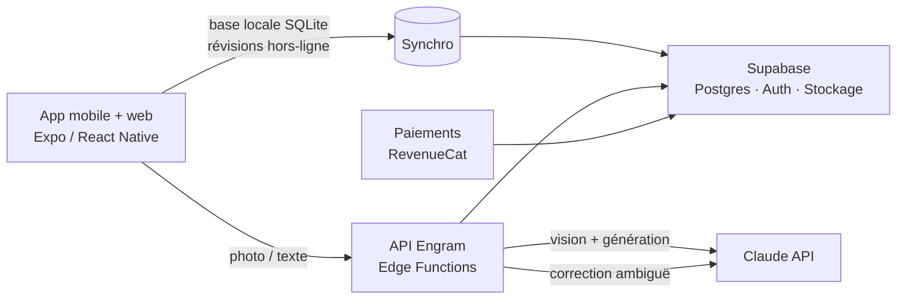

# Engram — fiche technique, idées et plan de construction

> **Engram** : l'app de flashcards qui fait le travail à votre place.
> Vous photographiez votre cours, l'IA rédige les cartes, l'algorithme FSRS décide quand les revoir, et l'IA corrige vos réponses même quand elles ne sont pas mot pour mot.

Ce document accompagne le prototype fonctionnel livré dans ce dossier (`engram/index.html`). Il couvre :

1. [Anki : ce qu'il fait bien, ce qu'il fait mal](#1-anki--ce-quil-fait-bien-ce-quil-fait-mal)
2. [Ce que le prototype fait déjà](#2-ce-que-le-prototype-fait-déjà)
3. [Les fonctionnalités cibles](#3-les-fonctionnalités-cibles)
4. [Architecture technique de la vraie app](#4-architecture-technique-de-la-vraie-app)
5. [Le pipeline IA en détail](#5-le-pipeline-ia-en-détail)
6. [Coûts de l'IA, chiffrés](#6-coûts-de-lia-chiffrés)
7. [Budget de construction](#7-budget-de-construction)
8. [Modèle économique](#8-modèle-économique)
9. [Planning pas à pas](#9-planning-pas-à-pas)
10. [Indicateurs à suivre](#10-indicateurs-à-suivre)
11. [Risques et parades](#11-risques-et-parades)
12. [Design : le système visuel](#12-design--le-système-visuel)

---

## 1. Anki : ce qu'il fait bien, ce qu'il fait mal

| | Anki |
|---|---|
| **Principe** | Répétition espacée + rappel actif : on revoit une notion juste avant de l'oublier. |
| **Algorithme** | SM-2 modifié historiquement ; **FSRS** intégré depuis Anki 23.10 (fin 2023), nettement plus précis. |
| **Types de cartes** | Recto/verso, texte à trous (cloze), masquage d'image (intégré depuis 23.10), modèles HTML/CSS/JS personnalisables. |
| **Technique** | Bureau : Python + Qt, cœur en Rust (planification, synchro), interface de révision en TypeScript/Svelte. |
| **Plateformes** | Windows / macOS / Linux (gratuit), AnkiDroid (gratuit, open source), AnkiMobile iOS (payant, environ 25 $), AnkiWeb (synchro gratuite). |
| **Écosystème** | Des milliers d'extensions et de paquets partagés (médecine, langues, concours). |

**Ses faiblesses sont nos opportunités :**

- **Création manuelle** : il faut taper chaque carte. C'est le premier motif d'abandon.
- **Interface datée** et paramètres intimidants (étapes d'apprentissage, facteurs de facilité…).
- **Correction binaire** : en mode « taper la réponse », Anki compare caractère par caractère. Un synonyme = faux.
- **Aucune pédagogie** : quand on bloque sur une carte, Anki la remontre, sans jamais l'expliquer autrement.
- **Motivation** : pas de série, pas d'objectifs, pas de social.

Concurrents qui font déjà de la génération IA : Quizlet, Knowt, RemNote, Brainscape. La différence d'Engram doit venir de la **qualité** : lecture fiable de l'écrit manuscrit, cartes bien formulées, FSRS, correction sémantique réglable, et un design au niveau des meilleures apps grand public.

---

## 2. Ce que le prototype fait déjà

Le fichier `engram/index.html` est une application complète, sans dépendance, qui s'ouvre dans n'importe quel navigateur. Publiée comme artefact dans l'app Claude, elle utilise en plus l'IA et la synchronisation du compte Claude de la personne.

| Fonctionnalité | Statut | Où dans le code |
|---|---|---|
| **Photo → fiches** (1 à 5 pages, manuscrit ou imprimé), **texte collé** ou **simple sujet** | ✅ avec IA (texte : aussi en local) | `runScan`, `buildScanPrompt`, `localGenerate` |
| Fiches qui tombent **en direct** sur le plateau pendant la génération (JSON Lines en streaming) | ✅ | `runScan` → `eat()` |
| Tri des fiches générées (cocher, modifier) avant rangement dans un tiroir | ✅ | `genHTML`, `editGen` |
| Types : question/réponse, **recto-verso 2 sens**, **texte à trous**, **QCM**, **vrai/faux**, **remise en ordre**, **masquage d'image** (légendes détectées par l'IA) | ✅ | `cardFaces`, `openEditor`, `openOcclusion` |
| **FSRS-5** (objectif de rétention réglable 80–97 %) et **boîte de Leitner** visuelle à quatre compartiments | ✅ | `FSRS`, `leitner` |
| File d'attente à la Anki : apprentissage → révisions → nouvelles intercalées, une fiche « sœur » par jour | ✅ | `Study.build` |
| Retournement 3D, **tampon encreur** à chaque note, **envol de la fiche vers son compartiment**, glisser à droite / à gauche | ✅ | `Study.grade`, `Study.bindCard` |
| **Réponse écrite ou dictée, corrigée par l'IA** : score, verdict, mots-clés manquants, annotation « stylo rouge » | ✅ | `aiGrade`, `Study.check`, `Dictation` |
| **Exigence choisie par l'utilisateur** : Souple / Standard / Strict (mot pour mot) | ✅ | `STRICT` |
| Correction locale de secours (fautes de frappe, mots-clés, chiffres obligatoires) | ✅ | `localGrade` |
| **Prof virtuel** après un échec, et **discussion par paquet** (« Demander au prof ») qui peut créer des fiches | ✅ | `Study.tutor`, `openChat` |
| **Fiche de synthèse** du chapitre, exportable en Markdown | ✅ | `openSheet` |
| Détection des **sangsues** + reformulation IA (« Améliorer avec l'IA ») | ✅ | `Study.grade`, `openEditor` |
| **Examen en vue** : compte à rebours, nouvelles fiches par jour, mémoire prévue le jour J | ✅ | `examInfo`, `openExamPlan` |
| **Jeux** : jeu des paires chronométré, **examen blanc noté sur 20 avec mention**, révision éclair | ✅ | `Game`, `buildExam` |
| **Mode écoute**, lecture à voix haute, **ambiance sonore** (bibliothèque, pluie) | ✅ | `openListen`, `Ambient` |
| Série sur « fiche de prêt », jauge du jour, niveaux, **ex-libris** (14 cachets de cire), **bordereau** de fin de séance | ✅ | `streak`, `BADGES`, `Study.summary` |
| **Partager sa progression** : image 1080 × 1350 générée | ✅ | `shareProgress` |
| Carnet : rétention réelle, courbe de l'oubli interactive sur papier millimétré, charge à venir, régularité | ✅ | `Views.stats` |
| Premier lancement guidé (profil, rythme, examen) | ✅ | `Onb` |
| Import CSV / TSV / export texte Anki / sauvegarde JSON ; export CSV | ✅ | `parseImport`, `exportDeckCSV` |
| Palette de commandes (Ctrl/⌘ K), raccourcis clavier complets, animations complètes ou rapides | ✅ | `openPalette` |
| Synchronisation multi-appareils (dans l'app Claude), stockage local sinon | ✅ | `Store` |
| Thème clair / sombre, mobile, accessibilité (mouvement réduit, focus visible) | ✅ | CSS |

Une page de présentation du projet, reprenant ce dossier en version illustrée et animée, est fournie dans `engram/dossier.html`.

---

## 3. Les fonctionnalités cibles

Organisées en cinq piliers. ★ = ce qui fait le prestige de la version premium.

### Capturer (zéro saisie)
- Photo de cours, **multi-pages**, avec redressement automatique de la perspective et détection des bords de feuille.
- **PDF** (polycopiés, diapositives de cours) : une carte par notion, les diapos deviennent des masquages d'image.
- ★ **Enregistrement audio du cours** → transcription → cartes (l'étudiant enregistre l'amphi).
- ★ Lien **YouTube / page web** → cartes avec l'horodatage de la source.
- Partage depuis n'importe quelle app (feuille de partage iOS/Android) : une capture d'écran devient des cartes.
- Import Anki (`.apkg`), Quizlet (texte), Notion, Google Docs.

### Comprendre
- ★ **Prof virtuel** : explique autrement, avec une analogie, puis repose la question sous un autre angle.
- ★ **Cartes « pourquoi »** : l'IA ajoute des cartes de causalité, pas seulement de définition.
- Carte mentale générée pour chaque chapitre, cliquable vers les cartes.
- Chaque carte garde un lien vers **l'extrait source** (la zone de la photo), pour vérifier.

### Retenir
- FSRS **optimisé pour chaque personne** : après environ 1 000 révisions, on entraîne ses propres paramètres (optimiseur `fsrs-rs`) — 10 à 30 % de révisions en moins pour la même rétention.
- ★ **Mode « veille d'examen »** : on indique la date de l'examen, Engram planifie pour arriver à 95 % de rétention ce jour-là.
- Entrelacement intelligent des matières, gestion automatique des sangsues (reformulation, découpage en deux cartes).

### Évaluer
- ★ **Correction sémantique en cascade** (voir §5) : rapide, peu coûteuse, et réglable par l'utilisateur.
- ★ **Réponse orale** : on répond à voix haute, la transcription est corrigée comme une réponse écrite.
- Examens blancs générés par l'IA, au format du vrai examen (bac, partiels, concours, code de la route…).
- Prédiction de note : « si l'examen avait lieu demain, vous auriez environ 14/20 ».

### Motiver
- Série, niveaux, objectifs (déjà dans le prototype).
- ★ **Groupes de révision** : une classe partage un paquet, classement hebdomadaire, défis entre amis.
- ★ **Bibliothèque de paquets vérifiés** par des enseignants (programme officiel), avec partage de revenus aux auteurs.
- Widgets d'écran d'accueil (cartes du jour), rappels intelligents à l'heure où l'on révise d'habitude.

---

## 4. Architecture technique de la vraie app



| Couche | Choix recommandé | Pourquoi |
|---|---|---|
| **App** | **Expo (React Native) + TypeScript** | Un seul code pour iOS, Android et le web ; la logique du prototype (FSRS, correction locale, écrans) se porte telle quelle. Flutter est une bonne alternative si l'équipe le connaît déjà. |
| **Stockage local** | SQLite (expo-sqlite ou WatermelonDB) | Réviser sans réseau dans le métro ; l'app reste instantanée. |
| **Backend** | **Supabase** (Postgres, Auth, Storage, Edge Functions) | Authentification, base, fichiers et fonctions serveur sans gérer de serveur. Hébergement en région UE pour le RGPD. |
| **IA** | **Claude API**, appelée **uniquement côté serveur** | Jamais de clé d'API dans l'app. Le serveur applique les quotas (gratuit / Pro). |
| **Algorithme** | `ts-fsrs` (client) + `fsrs-rs` (optimiseur serveur) | Open source, maintenus par l'équipe FSRS. |
| **Paiements** | RevenueCat (abonnements App Store / Play / web) | Gère les reçus, les essais gratuits et les remboursements. |
| **Analytique / erreurs** | PostHog + Sentry | Offres gratuites suffisantes au départ. |

**Modèle de données (tables principales)**

```
users           id, email, niveau, langue, plan, created_at
decks           id, user_id, name, color, lang, exam_date, updated_at
notes           id, deck_id, type, fields (jsonb), source_ref, created_at
cards           id, note_id, ord, due, stability, difficulty, state, reps, lapses, last_review
review_logs     id, card_id, rating, answer_text, ai_score, elapsed_ms, reviewed_at
media           id, user_id, storage_path, width, height
scan_jobs       id, user_id, status, pages, model, tokens_in, tokens_out, cost_usd, created_at
```

La séparation **note / carte** (comme Anki) permet qu'un texte à trous à 3 trous donne 3 cartes, ou qu'un recto-verso donne 2 cartes qui partagent le même contenu.

---

## 5. Le pipeline IA en détail

### Photo → cartes

1. **Dans l'app** : recadrage automatique, redressement, compression (côté long ≈ 1 500 px, JPEG).
2. **Serveur** : un appel à Claude avec l'image et la consigne (celle du prototype : `buildScanPrompt`). Réponse en **JSON Lines** : chaque carte arrive dès qu'elle est écrite, l'utilisateur voit les cartes apparaître.
3. **Contrôles** : format valide, doublons retirés, texte à trous bien formé, 4 choix distincts pour un QCM.
4. **Validation humaine** : l'utilisateur décoche ou corrige. Le taux de cartes gardées est le meilleur indicateur de qualité.

Règles de rédaction imposées au modèle (issues des « 20 règles de formulation » de la répétition espacée) : une idée par carte, réponse courte, question compréhensible hors contexte, rien d'inventé, ignorer l'illisible.

### Correction sémantique en cascade

L'objectif : accepter « centrale énergétique de la cellule » pour « mitochondrie » en mode souple, mais pas en mode strict — sans payer un appel d'IA à chaque réponse.

| Étape | Coût | Décide quand… |
|---|---|---|
| 1. Comparaison locale (normalisation, fautes de frappe, mots-clés, chiffres) | 0 | correspondance quasi exacte (≥ 97 %) |
| 2. Similarité sémantique par vecteurs (modèle d'embeddings léger, éventuellement embarqué dans l'app) | quasi nul | cas très proches ou très éloignés |
| 3. Juge IA (petit modèle rapide) avec le niveau d'exigence choisi | ~0,0008 $ | tout le reste |

Le prototype implémente les étapes 1 et 3. La note finale reste **toujours modifiable** par l'utilisateur ; chaque désaccord est enregistré pour améliorer la consigne.

### Exemple d'appel serveur (TypeScript, SDK officiel Anthropic)

```ts
import Anthropic from "@anthropic-ai/sdk";

// La clé est lue côté serveur depuis ANTHROPIC_API_KEY. Jamais dans l'app.
const client = new Anthropic();

export async function scannerPage(imageBase64: string, consigne: string) {
  const response = await client.beta.messages.create({
    model: "claude-opus-5",
    max_tokens: 16000,
    // Si le modèle décline une requête, l'API la rejoue sur le modèle de repli recommandé (paramètre bêta).
    betas: ["server-side-fallback-2026-07-01"],
    fallbacks: "default",
    messages: [
      {
        role: "user",
        content: [
          { type: "image", source: { type: "base64", media_type: "image/jpeg", data: imageBase64 } },
          { type: "text", text: consigne },
        ],
      },
    ],
  });
  if (response.stop_reason === "refusal") throw new Error("Contenu refusé par le modèle");
  // Une carte JSON par ligne.
  return response.content.flatMap((b) => (b.type === "text" ? [b.text] : [])).join("");
}
```

Pour la correction des réponses, le même appel sans image, avec la consigne de `aiGrade` et un modèle rapide (`claude-haiku-4-5`). En production, préférez la version en *streaming* pour afficher les cartes au fil de l'eau, comme le prototype.

---

## 6. Coûts de l'IA, chiffrés

Tarifs publics de l'API Claude (en dollars, par million de tokens, entrée / sortie) :

| Modèle | Entrée | Sortie | Rôle conseillé |
|---|---|---|---|
| Claude Opus 5 | 5 $ | 25 $ | Lecture des photos et rédaction des cartes (qualité maximale, manuscrit difficile) |
| Claude Sonnet 5 | 2 $ | 10 $ | Alternative moins chère pour la rédaction, à valider sur vos propres photos |
| Claude Haiku 4.5 | 1 $ | 5 $ | Correction des réponses, tâches courtes et fréquentes |

Une photo réduite à environ 1,2 mégapixel coûte environ **1 600 tokens** d'entrée (formule : largeur × hauteur / 750).

**Scan d'une page → 15 cartes** (≈ 2 300 tokens en entrée, ≈ 1 500 en sortie) :

| Modèle | Calcul | Coût par page |
|---|---|---|
| Opus 5 | 2 300 × 5 $ + 1 500 × 25 $ (par million) | **≈ 0,05 $** |
| Sonnet 5 | 2 300 × 2 $ + 1 500 × 10 $ | ≈ 0,02 $ |
| Haiku 4.5 | 2 300 × 1 $ + 1 500 × 5 $ | ≈ 0,01 $ |

Opus 5 et Sonnet 5 réfléchissent avant de répondre (réflexion adaptative) : prévoyez une marge de ×1,5 à ×2 sur la sortie, soit **0,07 à 0,10 $ par page avec Opus 5**.

**Autres postes :**
- Correction d'une réponse (Haiku 4.5, ≈ 350 tokens en entrée, 80 en sortie) : **≈ 0,0008 $**. 1 000 réponses corrigées ≈ 0,75 $ ; la cascade locale en évite environ la moitié.
- Explication du prof virtuel (≈ 400 en entrée, 250 en sortie) : ≈ 0,0033 $ avec Sonnet 5.
- **Batch API** : −50 % pour ce qui n'est pas urgent (import de gros PDF la nuit, génération des scripts audio).
- **Mise en cache des consignes** : les lectures en cache coûtent environ 10 % du prix d'entrée, mais seulement si la partie fixe de la consigne dépasse la taille minimale du modèle (quelques milliers de tokens) ; utile si vous enrichissez la consigne d'exemples.

**Coût IA par utilisateur et par mois** (hypothèses : Opus 5 pour les scans, marge de réflexion incluse)

| Profil | Usage | Coût IA / mois |
|---|---|---|
| Gratuit | 3 scans | ≈ 0,25 $ |
| Pro, usage normal | 30 scans, 600 corrections, 20 explications | ≈ 2,50 $ |
| Pro, usage intensif | 120 scans, 2 000 corrections | ≈ 10 $ → prévoir une limite « usage raisonnable » |

Le choix entre Opus 5 et Sonnet 5 pour les scans se fait sur des mesures : constituez un jeu de 50 vraies photos de cours (dont du manuscrit difficile), faites générer les cartes par les deux modèles, et comparez le taux de cartes gardées par de vrais étudiants.

---

## 7. Budget de construction

Trois façons de construire, du moins cher au plus rapide.

| | A. Fondateur + IA | B. Freelance senior | C. Agence |
|---|---|---|---|
| Qui code | Vous, avec Claude Code | 1 développeur React Native expérimenté | Équipe (chef de projet, 2 devs, designer) |
| Développement MVP | 0 € (votre temps) | 25 000 – 45 000 € | 60 000 – 120 000 € |
| Design (Figma, identité) | 0 – 1 500 € (le prototype sert de base) | 3 000 – 6 000 € | inclus |
| Durée jusqu'au MVP | 3 – 4 mois | 2 – 3 mois | 2 – 3 mois |
| **Total de départ** | **≈ 1 000 – 4 000 €** | **≈ 30 000 – 55 000 €** | **≈ 60 000 – 120 000 €** |

**Frais fixes, quel que soit le scénario**

| Poste | Coût |
|---|---|
| Compte Apple Developer | 99 $ / an |
| Compte Google Play | 25 $ une fois |
| Nom de domaine | ~15 € / an |
| Supabase Pro | 25 $ / mois (gratuit au tout début) |
| Expo EAS (compilation et mises à jour) | 0 – 19 $ / mois |
| RevenueCat | gratuit jusqu'à 2 500 $ de revenus mensuels |
| Sentry, PostHog | offres gratuites au départ |
| Dépôt de marque INPI (France, 1 classe) | ~190 € (≈ 40 € par classe en plus) |
| CGU, politique de confidentialité, RGPD | 500 – 1 500 € (avocat ou modèle vérifié) |
| Crédit IA pour la bêta (200 testeurs) | 50 – 150 $ |
| Lancement (contenu TikTok / Instagram par des étudiants, ambassadeurs) | 500 – 5 000 € |

Commission des stores sur les abonnements : **15 %** tant que le chiffre d'affaires reste sous 1 million de dollars par an (programme petites entreprises d'Apple, abonnements Google Play).

---

## 8. Modèle économique

L'IA coûte à chaque utilisation : un modèle **freemium avec abonnement** est indispensable.

| Offre | Prix | Contenu |
|---|---|---|
| Découverte | 0 € | 3 scans par mois, cartes illimitées, FSRS complet, correction locale |
| **Pro** | 6,99 € / mois | Scans illimités (usage raisonnable), correction IA, prof virtuel, examens blancs IA, synchro, mode écoute |
| Étudiant annuel | 49 € / an | Tout Pro, 2 mois offerts, groupes de classe, planning d'examen |

Marge sur un abonné Pro « normal » : 6,99 € − 15 % de commission − ≈ 2,30 € d'IA ≈ **3,60 € par mois**.
Seuil de rentabilité du scénario A (≈ 150 € de frais fixes par mois) : environ **45 abonnés**.
Avec un taux de conversion typique de 3 à 5 %, il faut 1 000 à 1 500 utilisateurs actifs gratuits.

---

## 9. Planning pas à pas

| Étape | Durée | Contenu | Livrable |
|---|---|---|---|
| 0. Prototype | fait | L'app web de ce dossier | `engram/index.html` |
| 1. Validation | 2 semaines | 20 étudiants testent le prototype ; on collecte 50 photos de cours réelles | Jeu d'évaluation, liste des irritants |
| 2. Réglage IA | 1 semaine | Comparer les modèles et affiner les consignes sur le jeu d'évaluation | Consignes figées, coût réel par page |
| 3. MVP mobile | 6 – 8 semaines | Expo : comptes, synchro, scan, révision, correction IA, paiement | Version TestFlight / test interne Play |
| 4. Bêta | 2 semaines | 100 – 200 testeurs, mesure de la rétention J1 / J7 / J30 | Corrections, fiches des stores |
| 5. Lancement | — | App Store, Play Store, web | Version 1.0 |
| 6. Itérations | continu | PDF, audio, groupes, optimiseur FSRS, bibliothèque partagée | Une nouveauté visible toutes les 2 semaines |

---

## 10. Indicateurs à suivre

- **Activation** : part des nouveaux qui font leur premier scan dans les 10 premières minutes.
- **Qualité IA** : part des cartes générées que l'utilisateur garde (objectif > 85 %).
- **Justesse de la correction** : part des verdicts IA modifiés par l'utilisateur (objectif < 5 %).
- **Rétention** : utilisateurs encore actifs à J7 et J30.
- **Révisions par utilisateur actif et par jour**, longueur moyenne des séries.
- **Conversion** gratuit → Pro, coût IA par abonné.

---

## 11. Risques et parades

| Risque | Parade |
|---|---|
| L'IA invente une information | Consigne « rien hors de la source », lien vers l'extrait d'origine, validation par l'utilisateur avant ajout. |
| Coûts d'IA qui dérapent | Quotas côté serveur, cascade de correction, Batch API, suivi du coût par utilisateur (`scan_jobs.cost_usd`). |
| Anki est gratuit | Ne pas se battre sur les fonctions : se battre sur le temps gagné (zéro saisie) et l'expérience. Proposer l'import `.apkg`. |
| RGPD et mineurs | Hébergement UE, suppression du compte en un clic, consentement parental en dessous de 15 ans (France), photos supprimées après génération si l'utilisateur le souhaite. |
| Droits d'auteur des cours | Les cartes restent privées par défaut ; le partage public exige que l'auteur détienne les droits. |
| Refus des stores | Achats intégrés conformes aux règles d'Apple et de Google pour tout contenu numérique ; pas de lien de paiement externe dans l'app. |

---

## 12. Design : le système visuel

L'identité part d'un lieu : **la salle de lecture**. Tout ce qu'on voit vient du monde réel de l'étude, pour éviter l'apparence générique des interfaces « faites par IA » (dégradés violets, verre dépoli, particules).

- **Couleurs** : vert bibliothèque (`#0D1411`, la lampe de banquier), laiton (`#C9A45C`) pour les actions principales, papier bristol pour les fiches, encre rouge pour les tampons et le stylo du correcteur. En clair : le bureau en journée, vert sauge et encre verte.
- **Objets** : les paquets sont des **tiroirs de fichier** avec porte-étiquette en laiton ; la progression est une **boîte de Leitner** dont on voit les fiches debout ; la série est une **fiche de prêt** tamponnée jour après jour ; la fin de séance imprime un **bordereau** ; les récompenses sont des **cachets de cire** (ex-libris) ; les statistiques sont tracées sur **papier millimétré**.
- **Les fiches sont de vraies fiches** : lignes bleues, marge rouge, numéro, retournement 3D, reflet qui suit le doigt ; les corrections de l'IA s'écrivent au stylo rouge.
- **Typographie** : Gloock (titres, grands chiffres, sérif à fort contraste), Schibsted Grotesk (interface), Courier Prime (étiquettes tapées à la machine, tampons, bordereau), Caveat (annotations manuscrites).
- **Mouvement** : un geste par moment clé — la pile de fiches qui se déploie, le tampon qui s'abat sur la fiche, la fiche qui s'envole vers son compartiment, le bordereau qui s'imprime. Réglable (« animations rapides ») et désactivé si le système demande de réduire les animations.
- **Couleurs des graphiques** validées pour le daltonisme, en clair comme en sombre.
